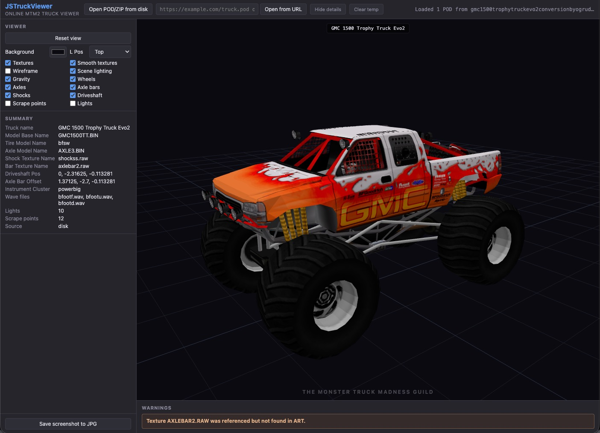

# JSTruckViewer

[](https://developer.mozilla.org/docs/Web/JavaScript)
[](https://threejs.org/)
[](https://developer.mozilla.org/docs/Web)
[](https://juanputrerasm.github.io/JSTruckViewer/)
[](LICENSE)

**A browser-based 3D truck viewer for Monster Truck Madness 2.**

JSTruckViewer opens POD and ZIP archives from disk or URL, reads their TRK manifests, decodes the referenced BIN models and textures, and assembles a complete truck in Three.js. All archive processing happens locally in the browser.

**Live application:** [Open JSTruckViewer on GitHub Pages](https://juanputrerasm.github.io/JSTruckViewer/)



---

## Features

- **POD and ZIP loading** — open a local archive, paste a URL, or autoload one through a query parameter.
- **Multi-truck archives** — discover every `TRUCK/*.TRK` manifest and switch trucks without reopening the archive.
- **Multi-POD ZIP packs** — stage and search all POD members contained in a ZIP.
- **Complete truck assembly** — render the body, four wheels, axles, axle bars, shocks, driveshaft, lights, and scrape points.
- **Interactive inspection** — orbit, pan, zoom, reset the camera, change lighting and background, toggle parts, textures, smoothing, wireframe, and gravity.
- **Screenshot export** — save the current viewport as a JPEG.
- **Client-side operation** — archives and extracted assets remain in temporary browser storage.

## Supported content

| Content | Support |
|---|---|
| POD1 | Original Terminal Reality POD directory layout |
| POD1-64 (Extended POD1) | POD1-compatible layout with 64-byte entry names |
| ZIP | One or more POD archives in a single pack |
| TRK | Truck manifest, component references, anchors, lights, and scrape points |
| BIN | Classic and updated MTM2 model records |
| RAW + ACT | Legacy paletted textures |
| PNG and TGA | High-definition diffuse and normal textures |

“Extended POD1” is not an official new POD version. It identifies the POD1-compatible directory layout whose name field is widened from 32 to 64 bytes.

## Modern MTM2 (Community Patch 3) rendering

The viewer supports the updated BIN texture and material records, including 64-byte texture names, polygon material assignments, reflection and color blocks, and material parameters. Diffuse texture lookup uses `.PNG`, then `.TGA`, then `.RAW`.

Normal maps use the engine's DirectX/green-down convention. RGB is interpreted directly as tangent X, bitangent Y, and surface Z after the standard `value * 2 - 1` decode. Alpha is unused; roughness is not read from the texture, and specular strength is a material value.

Updated four-wheel sets such as `16FL`, `16FR`, `16RL`, and `16RR` are selected when present. Legacy left/right wheel naming remains supported as a fallback.

## Requirements

- A modern browser with JavaScript modules, Web Workers, WebGL, and Origin Private File System support
- An HTTP or HTTPS origin; the application cannot run correctly from `file://`
- Network access to the Three.js and fflate CDN modules

## Getting started

### Use the hosted application

1. Open [JSTruckViewer on GitHub Pages](https://juanputrerasm.github.io/JSTruckViewer/).
2. Choose **Open POD/ZIP from disk**, or paste an archive URL and choose **Open from URL**.
3. Select a truck when the archive contains more than one manifest.
4. Use the mouse or touch controls to inspect the assembled truck.

> [!NOTE]
> Remote archives must be served over HTTP or HTTPS. Cross-origin servers must also allow the browser request through CORS.

### Run locally

Clone the repository and serve its root directory with any static HTTP server:

```bash
git clone https://github.com/juanputrerasm/JSTruckViewer.git
cd JSTruckViewer
python3 -m http.server 8080
```

Then open <http://localhost:8080/>. There is no build step and no package installation.

## Viewer controls

| Control | Action |
|---|---|
| Left drag / one-finger drag | Orbit the camera |
| Right drag / two-finger drag | Pan the camera |
| Mouse wheel / pinch | Zoom |
| Left / Right Arrow | Strafe the camera left / right |
| Reset view | Fit the current truck in the camera |
| Viewer toggles | Show, hide, or change individual rendering features and truck parts |
| Save screenshot to JPG | Download the current viewport |

## URL integration

Use `file` or `url` to autoload a POD or ZIP archive:

```text
https://juanputrerasm.github.io/JSTruckViewer/?file=https%3A%2F%2Fexample.com%2Ftruck.pod
https://juanputrerasm.github.io/JSTruckViewer/?url=%2Fdownloads%2Ftruck-pack.zip
```

Relative paths are resolved against the viewer page. If both parameters are present, `file` takes precedence. The same archive-loading path is used by the URL field and autoload links.

## Architecture

| Component | Role |
|---|---|
| ES modules | Application controller, archive staging, and scene management |
| Module Web Worker | POD indexing, TRK parsing, BIN decoding, and truck assembly |
| OPFS | Isolated temporary archive and extracted-asset storage |
| Three.js r169 | Rendering, lighting, camera controls, and screenshot capture |
| fflate 0.8.2 | ZIP extraction |

```text
src/
├── api.js                  Archive staging and worker API
├── viewer-app.js           User-interface controller
├── viewer-scene.js         Three.js scene and truck rendering
├── worker-client.js        Promise wrapper for the module worker
├── shared/                 OPFS and texture helpers
└── worker/                 POD, TRK, BIN, texture, and image decoders
```

## Known limitations

- The viewer does not simulate MTM2 vehicle physics or animation.
- Some TRK directives are parsed for diagnostics but do not affect rendering.
- Missing or ambiguous wheel assets require naming heuristics and may produce warnings.
- Browser image decoding availability depends on the browser's worker APIs.
- Material rendering approximates the updated MTM2 renderer in Three.js rather than reproducing it exactly.

## Related projects

- [JSPod](https://github.com/juanputrerasm/JSPod) — browser-based POD archive and individual-asset viewer.
- [KPodman](https://github.com/juanputrerasm/KPodman) — desktop POD archive manager.

## Format documentation

- [POD1-64 / Extended POD1](docs/POD1_64_FORMAT.md)
- [BIN HD / Extended BIN](docs/BIN_HD_FORMAT.md)
- [MTM2.1 / TRK 2.1](docs/TRK_2_1_FORMAT.md)

## Credits and license

Developed by **Juan Pablo Utreras** for the Monster Truck Madness community.

Released under the [Apache License 2.0](LICENSE).

Monster Truck Madness and Terminal Reality are trademarks of their respective owners. This project is an independent community tool and is not affiliated with or endorsed by them.
