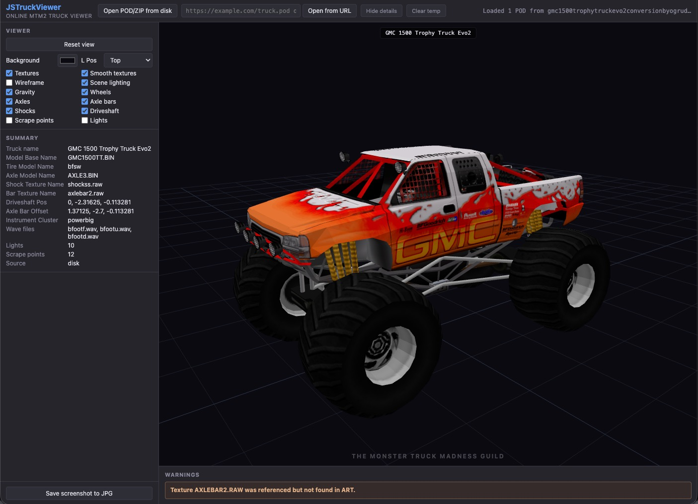

# JSTruckViewer

[](https://developer.mozilla.org/docs/Web/JavaScript)
[](https://threejs.org/)
[](https://developer.mozilla.org/docs/Web)
[](https://juanputrerasm.github.io/JSTruckViewer/)
[](LICENSE)

**A browser-based 3D vehicle viewer for Monster Truck Madness 1 & 2, CART Precision Racing, and 4x4 Evolution 1 & 2.**

JSTruckViewer opens POD and ZIP archives from disk or URL, reads their TRK or CAR manifests, decodes the referenced models and textures, and assembles a complete vehicle in Three.js. Classic MTM1 trucks, modern MTM2 trucks, CART Precision Racing cars and both generations of 4x4 Evolution all load through the same interface. All archive processing happens locally in the browser.

**Live application:** [Open JSTruckViewer on GitHub Pages](https://juanputrerasm.github.io/JSTruckViewer/)



---

## Features

- **POD and ZIP loading**: open a local archive, paste a URL, or autoload one through a query parameter.
- **Multi-vehicle archives**: discover every `TRUCK/*.TRK` and `VEHICLE/*.CAR` manifest and switch vehicles without reopening the archive.
- **Multi-POD ZIP packs**: stage and search all POD members contained in a ZIP.
- **Complete truck assembly**: render the body, four wheels, axles, axle bars, shocks, driveshaft, lights, and scrape points.
- **Truck lights**: flare sprites and beam cones for headlights, roof light bars, brake, reverse, and special lights, with spinning beacons and blinkers animated and each type toggleable.
- **MTM1 and MTM2 trucks**: classic MTM1 manifests are detected automatically and assembled as body plus four tires.
- **CART Precision Racing cars**: CAR manifests, high-detail CMD bodies, four individually named wheels, helmets, the BIN-based pace car, and selectable road-course or speedway wing packages.
- **4x4 Evo 1 & 2 trucks**: POD2 archives, TRK v6 and v7 manifests, SMF models, and Evo's paletted and TIFF textures with their real opacity channels.
- **Interactive inspection**: orbit, pan, zoom, reset the camera, change lighting and background, toggle parts, textures, smoothing, wireframe, and gravity.
- **Screenshot export**: save the current viewport as a JPEG.
- **Contextual browser titles**: the tab identifies the active vehicle and format while keeping `JSTruckViewer` as the application title.
- **Client-side operation**: archives and extracted assets remain in temporary browser storage.

## Supported content

| Content | Support |
|---|---|
| POD1 | Original Terminal Reality POD directory layout |
| POD2 | Signed and indexed archive used by 4x4 Evolution 1 and 2 |
| ZIP | One or more POD archives in a single pack |
| TRK (MTM2, MTM2.1) | Truck manifest, component references, anchors, lights, and scrape points |
| TRK (MTM1) | Classic manifest: body, one tire model, anchors, and scrape points |
| TRK (v6, v7) | 4x4 Evolution 1 and 2 manifest: showroom data, vec3 anchors, counted lists, and paint schemes |
| CAR (CPR) | CART Precision Racing vehicle manifest: CMD/BIN body, four wheel models, helmet, anchors, and scrape points |
| BIN | Classic and updated MTM2 model records, and the MTM1 records that share them |
| CMD | CART Precision Racing high-detail multipart vehicle geometry |
| SMF | 4x4 Evo "C3DModel" geometry, with per-group materials and bump-map references |
| RAW + ACT | Legacy paletted textures, including the shared MTM1 METALCR2 palette |
| RAW + ACT + OPA | 4x4 Evolution paletted textures with their 8-bit opacity plane |
| TIFF | 4x4 Evo 2 paletted diffuse textures and true-colour normal maps |
| PNG and TGA | MTM2 CommPatch 3 High-definition diffuse and normal textures |

POD1 has exactly one directory layout: 40-byte entries of `char name[32]`, `int32 size`, `int32 offset`, holding paths of up to 31 characters. A directory table that does not validate as 40-byte records is a malformed archive and is refused. See [POD1 format](docs/POD1_FORMAT.md). Optional `.ACT` palette metadata stored after `.RAW` paths is parsed without allowing trailing field bytes to affect entry lookup.

## MTM1 trucks support

A manifest whose first line is the bare `truckName` label, rather than an `MTM2` or `MTM2.1` header, is read as MTM1. MTM1 trucks name their body and tire models by full file name, reuse one tire model on all four corners, and have no axle model, axle bars, shocks, driveshaft, or lights. The viewer skips those parts instead of reporting them as missing, and greys out the toggles that cannot apply.

Palette resolution follows what the games actually do. A `RAW` texture uses its same-name `.ACT` when the archive provides one, otherwise `METALCR2.ACT` is used. MTM2 archives supply a same-name palette for practically every texture, so they resolve at the first step and are unaffected.

See [MTM1 truck format](docs/MTM1_TRK_FORMAT.md) for the field-by-field comparison.

## CART Precision Racing vehicles support

CPR archives store vehicle manifests under `VEHICLE/*.CAR`. Race cars reference a high-detail, text-based `.CMD` body, four explicitly named BIN wheels and a separate BIN helmet. The stock pace car references a BIN body instead. CMD parts retain their names and authored vertex normals, and `lowDetailCenterZ` aligns the detailed body with its referenced low-detail BIN.

The viewer renders the high-detail CMD body and preserves each named component as a separate mesh. CMD includes road/street-course and speedway/oval wing packages; a CPR-only selector switches between them without drawing both alternatives at once. The road-course package is the default. CPR's damage-state behavior is not simulated.

See [CPR CAR and CMD formats](docs/CPR_CAR_CMD_FORMAT.md) for the decoded layouts and coordinate conversions.

## 4x4 Evolution trucks support

A manifest whose first line is `version`, followed by `6` or `7`, is read as 4x4 Evolution or 4x4 Evolution 2. These archives differ from the MTM ones at three layers at once: the container is POD2, the models are `.SMF` rather than `.BIN`, and the textures carry a genuine opacity channel instead of MTM's black colour key.

Evo trucks are assembled as body plus four tires plus lights. All 271 stock manifests name `NULL.BIN` for the axle and `NULL.RAW` for the axle bars, and Evo bodies model their own suspension as ordinary geometry, so the axle, axle-bar, shock and driveshaft toggles are greyed out the same way they are for MTM1.

Transparency is handled differently from MTM's. Evo flags only its glass and light-lens groups as transparent and backs them with a real 8-bit plane — a same-stem `.OPA` in Evo 1, the second TIFF sample in Evo 2 — so those groups are blended rather than alpha-tested. Evo 2 additionally names a `_bump` normal map per group, which the viewer uses directly instead of guessing at a `_N` companion.

See [4x4 Evolution truck format](docs/EVO_TRK_FORMAT.md) for the POD2, TRK, SMF and texture details, including the measurements behind the axis, winding and V-orientation choices.

## Modern MTM2 (Community Patch 3) rendering

The viewer supports the updated BIN texture and material records, including 64-byte texture names, polygon material assignments, reflection and color blocks, and material parameters. Diffuse texture lookup uses `.PNG`, then `.TGA`, then `.RAW`.

Normal maps use the engine's DirectX/green-down convention. RGB is interpreted directly as tangent X, bitangent Y, and surface Z after the standard `value * 2 - 1` decode. Alpha is unused; roughness is not read from the texture, and specular strength is a material value.

Updated four-wheel sets such as `16FL`, `16FR`, `16RL`, and `16RR` are selected when present. Legacy left/right wheel naming remains supported as a fallback.

## Format library

POD parsing and RAW/ACT/OPA decoding come from [OpenPhotex](https://github.com/juanputrerasm/OpenPhotex), the shared Terminal Reality format library also used by JSPod, JSTrackViewer and JSMTM2Converter, vendored as plain ES modules in `src/vendor/openphotex/`. The vendored copy is generated, never edited here: change OpenPhotex, then refresh it from the OpenPhotex checkout with `npm run build && npm run vendor -- ../JSTruckViewer/src/vendor/openphotex`.

## Requirements

- A modern browser with JavaScript modules, Web Workers, WebGL, and Origin Private File System support
- An HTTP or HTTPS origin; the application cannot run correctly from `file://`
- Network access to the Three.js and fflate CDN modules

## Getting started

### Use the hosted application

1. Open [JSTruckViewer on GitHub Pages](https://juanputrerasm.github.io/JSTruckViewer/).
2. Choose **Open POD/ZIP from disk**, or paste an archive URL and choose **Open from URL**.
3. Select a truck when the archive contains more than one manifest.
4. Use the mouse or touch controls to inspect the assembled truck.

> [!NOTE]
> Remote archives must be served over HTTP or HTTPS. Cross-origin servers must also allow the browser request through CORS.

### Run locally

Clone the repository and serve its root directory with any static HTTP server:

```bash
git clone https://github.com/juanputrerasm/JSTruckViewer.git
cd JSTruckViewer
python3 -m http.server 8080
```

Then open <http://localhost:8080/>. There is no build step and no package installation.

## Viewer controls

| Control | Action |
|---|---|
| Left drag / one-finger drag | Orbit the camera |
| Right drag / two-finger drag | Pan the camera |
| Mouse wheel / pinch | Zoom |
| Left / Right Arrow | Strafe the camera left / right |
| Up / Down Arrow | Move the camera forward / backward |
| Reset view | Fit the current truck in the camera |
| Viewer toggles | Show, hide, or change individual rendering features and truck parts |
| Save screenshot to JPG | Download the current viewport |

## URL integration

Use `file` or `url` to autoload a POD or ZIP archive:

```text
https://juanputrerasm.github.io/JSTruckViewer/?file=https%3A%2F%2Fexample.com%2Ftruck.pod
https://juanputrerasm.github.io/JSTruckViewer/?url=%2Fdownloads%2Ftruck-pack.zip
```

Relative paths are resolved against the viewer page. If both parameters are present, `file` takes precedence. The same archive-loading path is used by the URL field and autoload links.

## Architecture

| Component | Role |
|---|---|
| ES modules | Application controller, archive staging, and scene management |
| Module Web Worker | POD indexing, TRK/CAR parsing, BIN/CMD/SMF decoding, and vehicle assembly |
| OPFS | Isolated temporary archive and extracted-asset storage |
| Three.js r169 | Rendering, lighting, camera controls, and screenshot capture |
| fflate 0.8.2 | ZIP extraction |

```text
src/
├── api.js                  Archive staging and worker API
├── viewer-app.js           User-interface controller
├── viewer-scene.js         Three.js scene and truck rendering
├── worker-client.js        Promise wrapper for the module worker
├── shared/                 OPFS and texture helpers
└── worker/                 POD, manifest, model, texture, and image decoders
```

## Known limitations

- The viewer does not simulate MTM2 vehicle physics or animation.
- CART Precision Racing damage states and non-zero CMD part rotations are not simulated.
- Some TRK directives are parsed for diagnostics but do not affect rendering.
- Missing or ambiguous wheel assets require naming heuristics and may produce warnings.
- Browser image decoding availability depends on the browser's worker APIs.
- Material rendering approximates the updated MTM2 renderer in Three.js rather than reproducing it exactly.

## Related projects

- [JSPod](https://github.com/juanputrerasm/JSPod) browser-based POD archive and individual-asset viewer.
- [JSTrackViewer](https://github.com/juanputrerasm/JSTrackViewer) browser-based POD archive track viewer.

## Format documentation

- [POD1 format](docs/POD1_FORMAT.md)
- [BIN HD / Extended BIN](docs/BIN_HD_FORMAT.md)
- [MTM2.1 / TRK 2.1](docs/TRK_2_1_FORMAT.md)
- [MTM1 truck format](docs/MTM1_TRK_FORMAT.md)
- [CPR CAR and CMD formats](docs/CPR_CAR_CMD_FORMAT.md)

## Credits and license

Developed by **Juan Pablo Utreras** for the Monster Truck Madness Guild.

Released under the [Apache License 2.0](LICENSE).

Monster Truck Madness, 4x4 Evolution and Terminal Reality are trademarks of their respective owners. This project is an independent community tool and is not affiliated with or endorsed by them.
